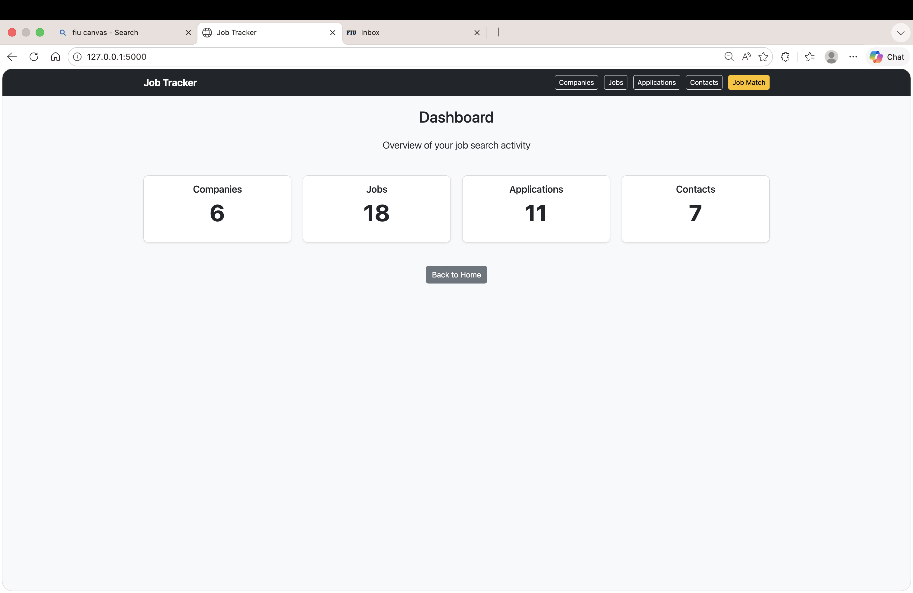
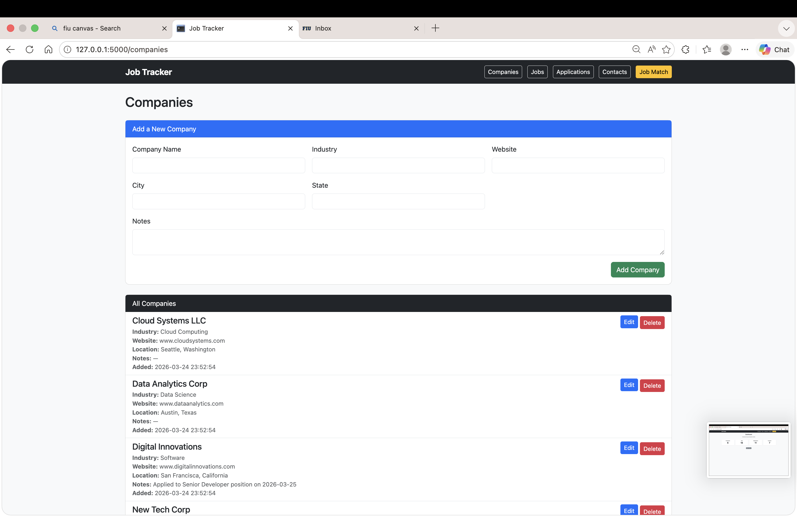
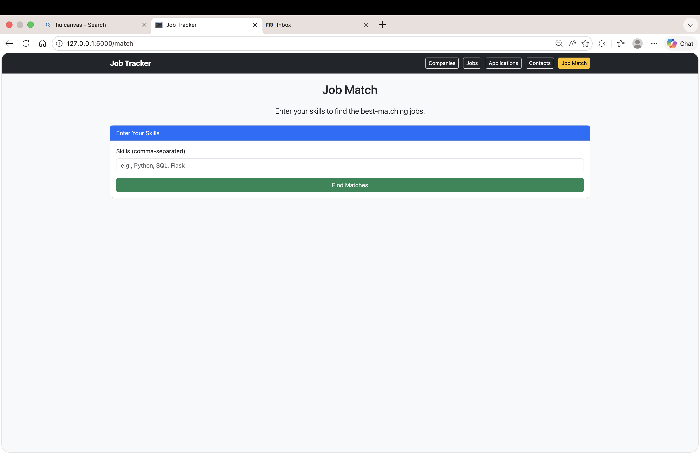
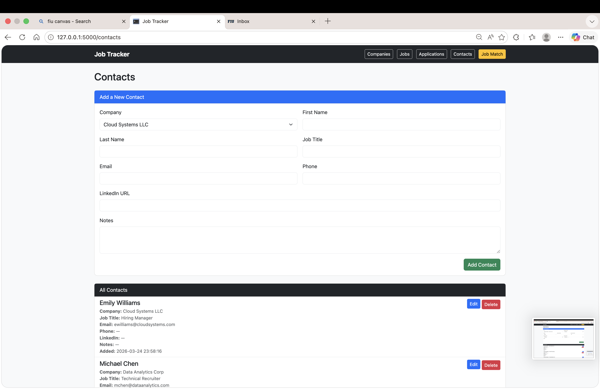
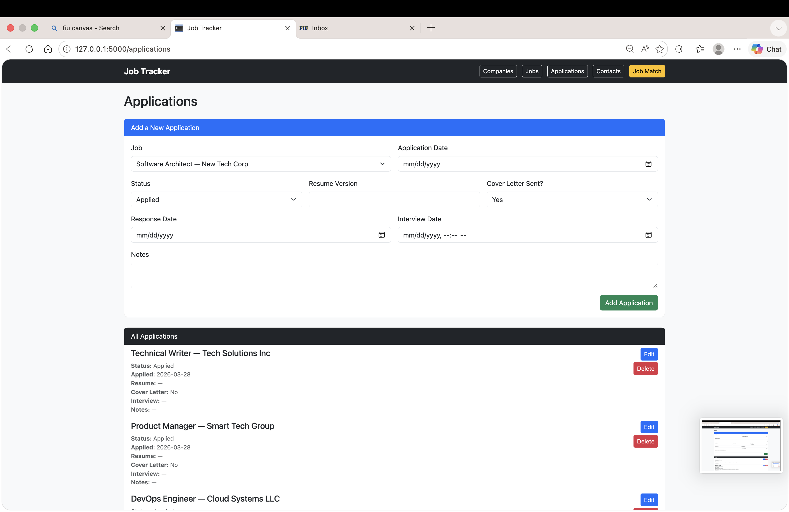
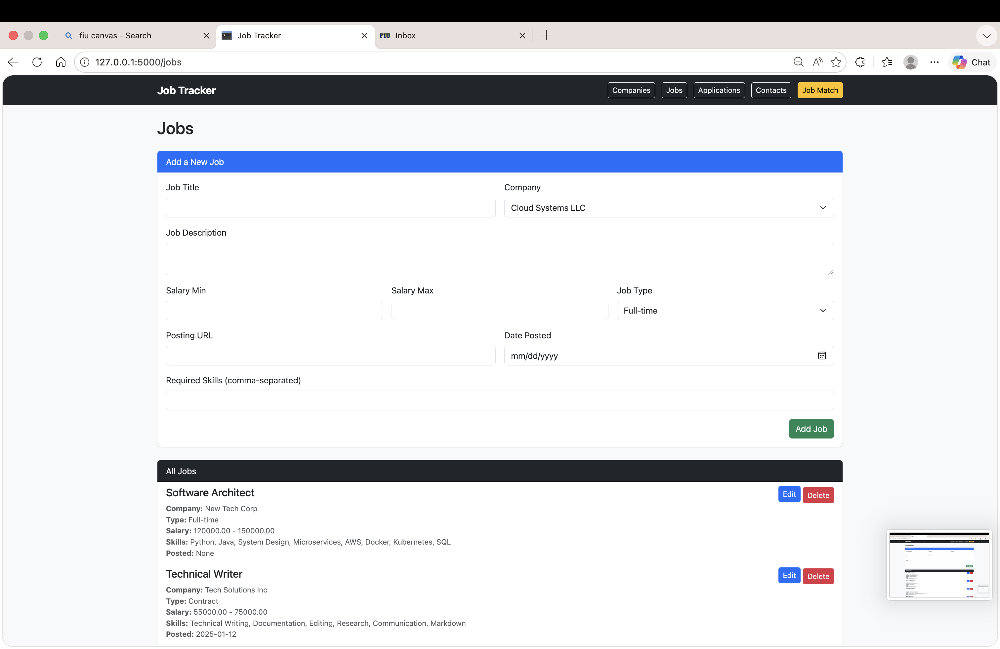

 README.md — Job Application Tracker
 Overview
The Job Application Tracker is a full‑stack web application built with Flask, MySQL, and Bootstrap that helps users manage companies, jobs, contacts, and applications in one organized dashboard.
It includes full CRUD functionality, relational database design with foreign keys, and a job‑matching feature that calculates how well a job aligns with a user’s skills.
This project was developed for COP4751 – Course Project.

 Database Schema
The application uses 4 fully‑related tables, each with proper foreign keys and constraints:
companies – stores employer information
jobs – stores job postings (FK → companies)
contacts – stores recruiter/hiring manager info (FK → companies)
applications – tracks job applications (FK → jobs)
 Key Relationships
Deleting a company automatically deletes its jobs (ON DELETE CASCADE)
Jobs link to companies
Contacts link to companies
Applications link to jobs
 JSON Columns
job_skills stored as JSON for flexible skill matching

 Features (CRUD)
The app supports full CRUD for all tables:
✔ Companies
Add, edit, delete
View company details
Cascade delete removes all related jobs
✔ Jobs
Add, edit, delete
Skill matching
Salary range
Job type
Posting URL
Active/inactive toggle
✔ Contacts
Add, edit, delete
Associate contacts with companies
✔ Applications
Track application status
Add notes
Associate applications with jobs

 Job Match Feature
Each job includes a Match Score (%) based on overlap between:
Job’s required skills
User’s stored skills
The score is displayed on the job detail page and helps users quickly identify strong opportunities.

 User Interface
Clean Bootstrap layout
Responsive design
Navigation bar for all sections
Tables for listing data
Forms for CRUD operations
Flash messages for success/error feedback
Delete confirmation modal for destructive actions

 How to Run the Project
1. Install dependencies
bash

pip install -r requirements.txt
2. Import the database
Run the provided schema.sql in MySQL Workbench.
3. Start the Flask server
bash

python app.py
4. Visit the app
Code

http://127.0.0.1:5000

 Project Structure
Code

/project
│── app.py
│── database.py
│── schema.sql
│── static/
│── templates/
│── README.md
│── AI_USAGE.md
│── requirements.txt

 AI Usage Documentation
See AI_USAGE.md for:
Prompts used
Code generated with AI assistance
Modifications made
Reflections on responsible AI usage

 Technologies Used
Python (Flask)
MySQL
Bootstrap 5
Jinja2 Templates
JSON columns
SQLAlchemy‑style patterns (manual SQL)

 Screenshots (Optional)

 ## Video Walkthrough

    <a href="https://www.loom.com/share/9a0a1f0f93c840b69dc227693e27494c">
      
Job tracker— Class_project - 1 April 2026 - Watch Video

    </a>
    
  

gif)](https://www.loom.com/share/9a0a1f0f93c840b69dc227693e27494c)

 License
This project is for educational use under COP4751